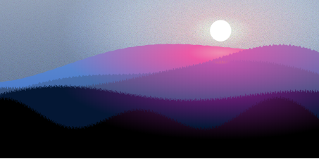

# Procedurally Generated SVG Landscapes

**Source:** https://kwa.ng/procedurally-generated-svg-landscapes/

## Building
1. `npm install`
2. `npm install -g browserify`
3. `browserify terrain-3.js -o bundle.js`
